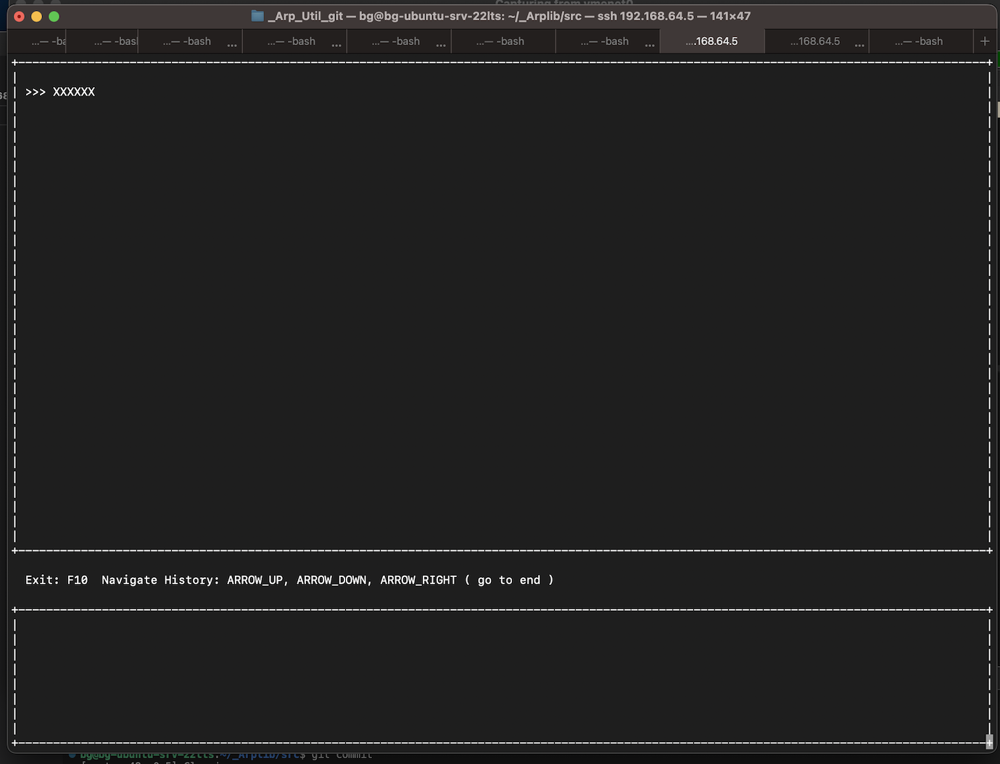
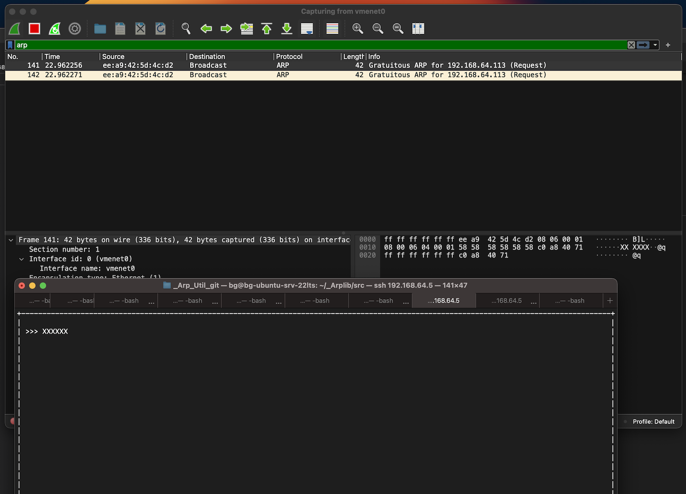

Description:
============

Arpchat is a program implementing a chat using malformed gratuitous ARP packets:

<BR>

as shown in the following picture, messages are sent using malformed ARP packets:

<BR>

Disclaimers:
============

* This program is intended to be a concept to exploit arp messages ans should not be used in production environment because could create serious malfunctions in network communications. So I discourage the use of this software outside controlled test environments. I will not be responsible of any damage this software could cause. So don't call me if your network administrator is looking for you with homicidal intentions because you are using arpchat in production environment, I advised you.

* Before using this program you should be familiar with gratuitous ARP requests (RFC 5227).


Prerequisites:
==============

The program is intended to be used in a Linux environment and it is tested using the following Linux distributions:

- Ubuntu 22.04.2 LTS (jammy) for ARM<BR>
- Ubuntu 22.04.2 LTS (jammy) for x86-64<BR>

using, as compiler, one in this list:<BR>

- g++ (Ubuntu 11.3.0-1ubuntu1~22.04.1) 11.3.0  (ARM)<BR>
- g++ (Ubuntu 11.3.0-1ubuntu1~22.04.1) 11.3.0  (x86-64)<BR>

To compile the program, this tools/libraries are necessary:

* a c++ compiler ( with c++17 support);
* automake/autoconf with libtool;
* libcap (Capabilities lib), example for Ubuntu/DEbian:
```
  sudo apt install  libcap-dev
```
* liblua , example for Ubuntu/Debian:
```
  sudo apt install liblua5.4-dev
```

Installation:
=============

- launch the configure script:
```
  ./configure
```
- Compile the program:
```
  make
```
- Install the program and the man page:
```
  sudo make install
```

* set capabilities:
```
  sudo setcap cap_net_raw=eip src/arpchat   
```

Configuration:
==============

* A template config file is provided in "data" directory, it uses LUA syntax to define variables storing configuration data;
* Your configuration should be compliant with RFC 5227 ( gratuitous ARP requests );
* To avoid gargage printed on the chat conversation panel, set accordigly the filter in configuration file.

Example:
========

* The following example shows how to start the application:
```
 ./arpchat -i enp0s1 -d0 -f ../data/arpchat.lua
```
where:
- enp0s1 is the network interface used to communicate<BR>
- ../data/arpchat.lua is the config file path<BR>
- 0 is the selected debugging level<BR>

See included man page for further information.

Log file:
=========

* A log file called "arpchat.log.txt" will be created inside program directory.

Instructions:
=============

See the man page included in the release.


